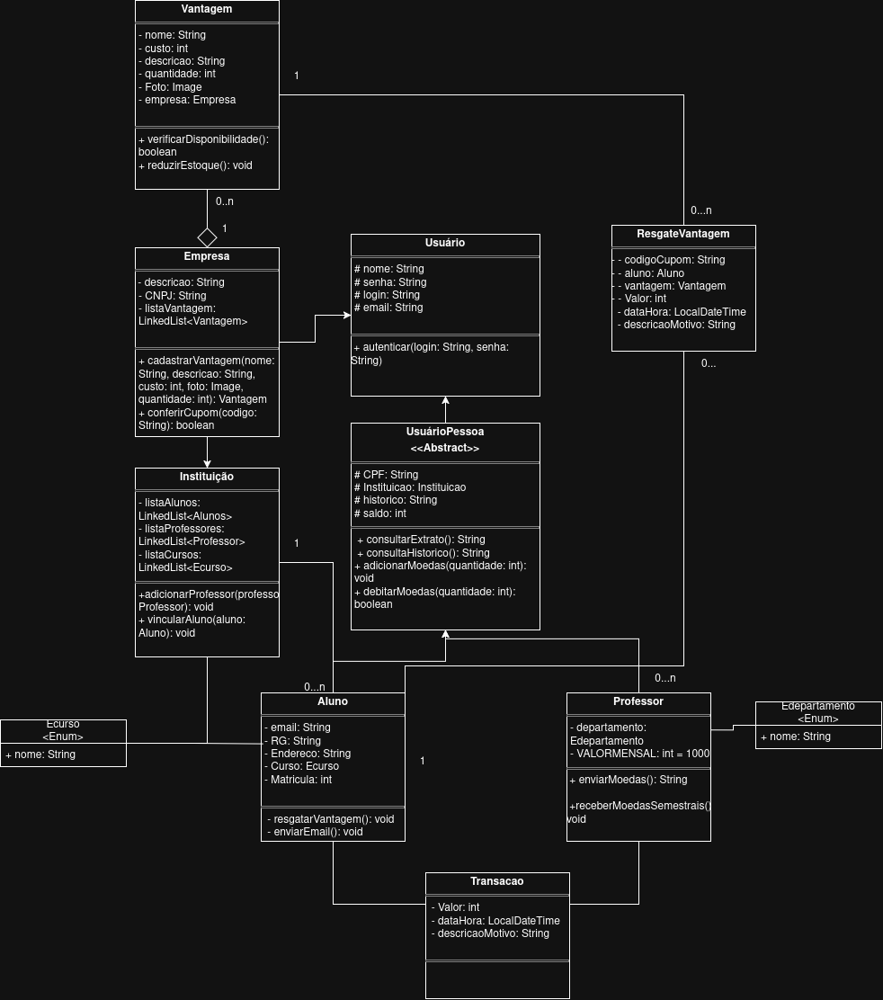
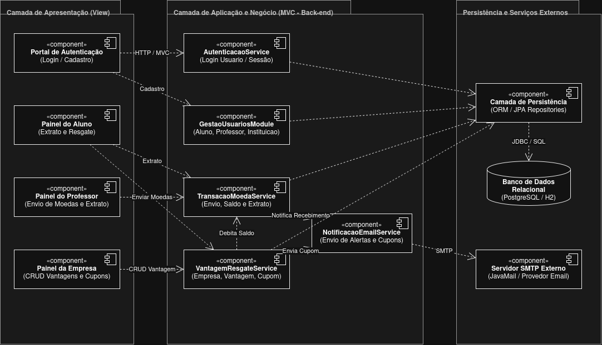
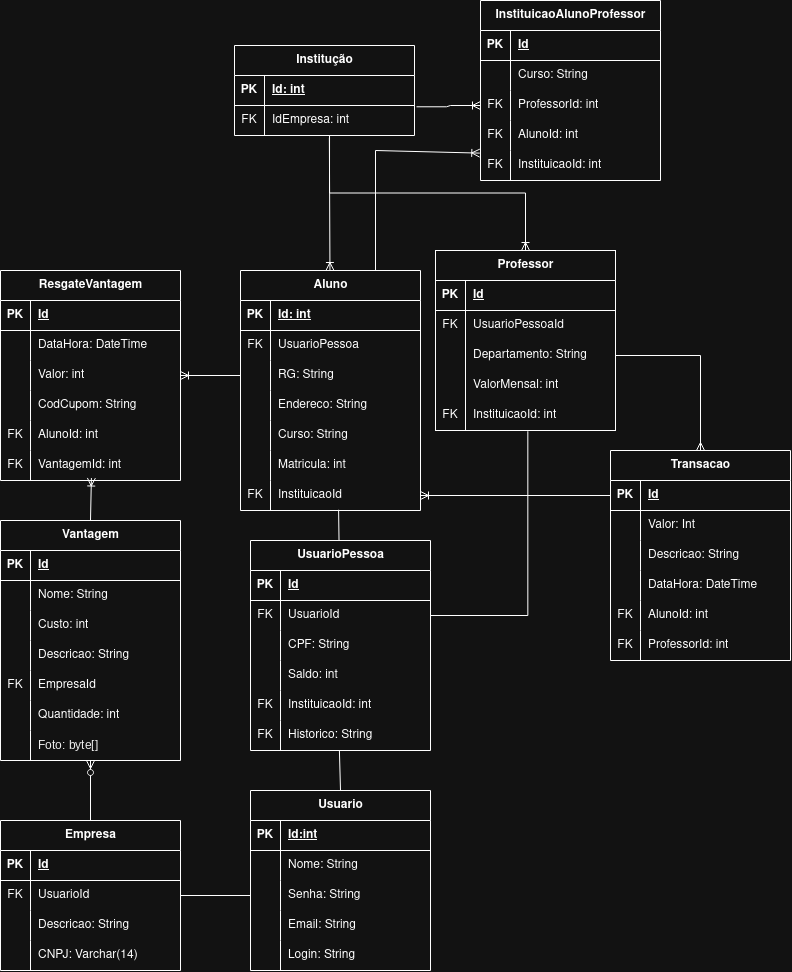

# TOKEN — Sistema de Moeda Estudantil

> **T**alent & **O**utstanding **K**nowledge **E**ducational **N**etwork

O **TOKEN** (*Talent & Outstanding Knowledge Educational Network*) permite que professores reconheçam o mérito dos alunos enviando moedas virtuais. Os alunos trocam essas moedas por vantagens (descontos e produtos) cadastradas por empresas parceiras e recebem um cupom com código único por e-mail para usar na troca presencial.

---

## Modelagem do Sistema

### Diagrama de Classes


### Diagrama de Componentes


### Modelo Entidade-Relacionamento (ER)


### Diagrama de Casos de Uso
Consulte o arquivo [Diagrama_Casos_de_Uso.drawio.pdf](Diagramas/Diagrama_Casos_de_Uso.drawio.pdf).

---

## Histórias de Usuário

| ID | História | Status |
|----|----------|--------|
| US01 | **Autenticação.** Como usuário (aluno, professor ou empresa parceira), quero fazer login com usuário e senha para acessar as funcionalidades do meu perfil com segurança. | ✅ |
| US02 | **CRUD de Aluno.** Como aluno, quero gerenciar meu cadastro (dados pessoais, instituição de ensino e curso) para participar do sistema de mérito estudantil. | ✅ |
| US03 | **CRUD de Empresa Parceira.** Como empresa parceira, quero fazer e gerenciar meu cadastro no sistema para ofertar produtos e descontos aos estudantes. | ✅ |
| US04 | **Cadastro de Vantagens.** Como empresa parceira, quero cadastrar vantagens com nome, descrição, foto, estoque e custo em moedas para disponibilizá-las no catálogo de trocas. | ✅ |
| US05 | **Envio de Moedas.** Como professor, quero enviar moedas do meu saldo acumulado (1.000 por semestre) a um aluno, informando o motivo do reconhecimento, para premiar seu mérito e notificá-lo por e-mail. | ✅ |
| US06 | **Consulta de Extrato.** Como aluno ou professor, quero consultar meu saldo atual e o histórico de transações para acompanhar minhas movimentações de moedas. | ✅ |
| US07 | **Resgate de Vantagem.** Como aluno, quero trocar minhas moedas por uma vantagem disponível e receber por e-mail um cupom com código único (também enviado à empresa parceira) para usá-lo presencialmente. | ✅ |

---

## Tecnologias

Detalhes, versões e o papel de cada tecnologia: **[STACK.md](STACK.md)**.

| Camada | Tecnologia |
|--------|-----------|
| View (front-end) | React 19 + React Router, Vite, Tailwind CSS 4 (SPA empacotada dentro do jar do Spring Boot) |
| Testes | Vitest + Testing Library (front-end), JUnit 5 + MockMvc (back-end) |
| Controller | Spring Web MVC (API REST), Bean Validation (inclusive `@CPF` e `@CNPJ`) |
| Model / Service | Java 21, Spring Boot 3.5 |
| Persistência | Spring Data JPA + Hibernate (ORM), padrão Repository/DAO, banco H2 em arquivo |
| Segurança | Sessão HTTP, senhas com hash **BCrypt**, controle de acesso por perfil (`@PerfilPermitido`) |
| E-mail | Spring Mail (SMTP), envio assíncrono após o commit da transação; Mailpit no ambiente Docker |
| Infraestrutura | Docker e Docker Compose |

## Arquitetura (MVC em camadas)

```
token/src/main/java/com/management
├── controller/   → Controllers REST (C do MVC) + tratamento global de erros
├── auth/         → Interceptor de autenticação, @Publico, @PerfilPermitido, UsuarioLogado
├── service/      → Regras de aplicação (AutenticacaoService, AlunoService, EmpresaService,
│                   ProfessorService, VantagemService, TransacaoMoedaService,
│                   VantagemResgateService, NotificacaoEmailService)
├── model/        → Entidades JPA com as regras de domínio (M do MVC)
├── repository/   → Interfaces Spring Data JPA (camada de acesso a dados / DAO)
├── dto/          → Objetos de entrada/saída da API (a senha nunca é exposta)
├── event/        → Eventos de domínio que disparam e-mails após o commit
└── config/       → Seed de dados, agendamento do crédito semestral, configuração web (serve o React)

frontend/src      → View (React)
├── pages/        → telas por perfil: publico/, aluno/, professor/, empresa/ e ExtratoPage
├── components/   → layout, rotas protegidas, formulários, gráfico e componentes de UI
├── context/      → sessão do usuário (AuthContext) e notificações
├── hooks/ lib/   → acesso à API, validações, formatação e indicadores dos painéis
└── test/         → utilitários do Vitest (mock da API e dados de exemplo)
```

Os componentes do diagrama correspondem ao código assim:

| Componente do diagrama | Implementação |
|------------------------|---------------|
| Portal de Autenticação | `frontend/src/pages/publico/*` + `AuthContext` + `RotaProtegida` |
| Painéis (Aluno, Professor, Empresa) | `frontend/src/pages/aluno/*`, `professor/*`, `empresa/*` |
| AutenticacaoService | `AutenticacaoService` + `AuthController` + `AutenticacaoInterceptor` |
| GestaoUsuariosModule | `AlunoService`, `EmpresaService`, `ProfessorService`, `InstituicaoService` |
| TransacaoMoedaService | `TransacaoMoedaService` (envio, saldo e extrato) |
| VantagemResgateService | `VantagemService` (CRUD de vantagens) + `VantagemResgateService` (resgate e cupom) |
| NotificacaoEmailService | `NotificacaoEmailService` |
| Camada de Persistência | `repository/*` (Spring Data JPA) |

---

## Como Executar (Docker, sem instalar Java nem Maven)

Pré-requisito: **Docker Desktop**.

```bash
# na raiz do repositório
docker compose up --build
```

| Serviço | Endereço |
|---------|----------|
| Aplicação | http://localhost:8080 |
| Caixa de e-mails (Mailpit): todos os e-mails enviados aparecem aqui | http://localhost:8025 |
| Console do H2 | http://localhost:8080/h2-console (JDBC URL `jdbc:h2:file:./data/tokendb`, usuário `sa`, senha em branco) |

Outros comandos:

```bash
docker compose run --rm testes            # testes do back-end (JUnit + MockMvc)
docker compose run --rm testes-front      # testes do front-end (Vitest + Testing Library)
docker compose --profile dev up --build   # front com hot reload em http://localhost:5173
docker compose down                       # para os containers (mantém o banco)
docker compose down -v                    # para e APAGA o banco (volta aos dados iniciais)
```

### Usuários de demonstração

| Perfil | Login | Senha |
|--------|-------|-------|
| Professor (PUC Minas) | `milena.adao` | `senha123` |
| Professor (PUC Minas) | `ricardo.almeida` | `senha123` |
| Professor (UFMG) | `carlos.silva` | `senha123` |
| Aluno (PUC Minas) | `lucas.santos` | `aluno123` |
| Aluno (PUC Minas) | `mariana.alves` | `aluno123` |
| Empresa | `livraria.univ` | `empresa123` |
| Empresa | `restaurante.campus` | `empresa123` |

**Roteiro de demonstração:**
1. Entre como `milena.adao` e envie moedas para Lucas.
2. Abra o Mailpit e veja o e-mail de notificação.
3. Entre como `lucas.santos`, consulte o extrato e resgate o "Café com pão de queijo".
4. Confira os dois e-mails com o código do cupom no Mailpit.
5. Entre como `restaurante.campus`, confira o cupom e marque-o como utilizado.

### Execução sem Docker (opcional)
Requer Java 21, Maven e Node 22 instalados:
1. Back-end: `cd token && mvn spring-boot:run` (API em http://localhost:8080).
2. Front-end: `cd frontend && npm install && npm run dev`. Abra http://localhost:5173; o Vite encaminha `/api` para a porta 8080.

Sem um servidor SMTP local, os e-mails falham e o erro aparece apenas no log; as operações continuam funcionando normalmente.

---

## Endpoints da API REST

🔓 = público · 🎓 aluno · 👩‍🏫 professor · 🏢 empresa

| Método | Rota | Acesso | Descrição |
|--------|------|--------|-----------|
| POST | `/api/auth/login` | 🔓 | Login (cria sessão) |
| POST | `/api/auth/logout` | 🔓 | Logout |
| GET | `/api/auth/me` | logado | Usuário da sessão |
| GET | `/api/instituicoes` · `/api/cursos` | 🔓 | Dados de apoio ao cadastro |
| POST | `/api/alunos` | 🔓 | Cadastro de aluno |
| GET / PUT / DELETE | `/api/alunos/me` | 🎓 | Consultar, editar ou excluir o próprio cadastro |
| GET | `/api/alunos` | 👩‍🏫 | Alunos da instituição do professor |
| POST | `/api/empresas` | 🔓 | Cadastro de empresa parceira |
| GET | `/api/empresas` | 🔓 | Lista pública de parceiras |
| GET / PUT / DELETE | `/api/empresas/me` | 🏢 | Consultar, editar ou excluir o próprio cadastro |
| GET | `/api/professores/me` | 👩‍🏫 | Dados e saldo do professor |
| GET | `/api/vantagens` | logado | Catálogo de vantagens |
| GET | `/api/vantagens/minhas` | 🏢 | Vantagens da empresa |
| POST / PUT | `/api/vantagens` · `/api/vantagens/{id}` | 🏢 | Cadastrar ou editar vantagem (multipart com foto) |
| DELETE | `/api/vantagens/{id}` | 🏢 | Excluir vantagem (bloqueado se já resgatada) |
| GET | `/api/vantagens/{id}/foto` | 🔓 | Foto da vantagem |
| POST | `/api/transacoes` | 👩‍🏫 | Enviar moedas (`alunoId`, `valor`, `motivo`) |
| GET | `/api/extrato` | 🎓 👩‍🏫 | Saldo e histórico de transações |
| POST | `/api/resgates` | 🎓 | Resgatar vantagem (gera cupom e envia e-mails) |
| GET | `/api/resgates` | 🎓 🏢 | Cupons do aluno ou resgates das vantagens da empresa |
| GET | `/api/resgates/cupom/{codigo}` | 🏢 | Conferir cupom |
| POST | `/api/resgates/cupom/{codigo}/utilizar` | 🏢 | Marcar cupom como utilizado |

## Regras de negócio implementadas

- Professores são pré-cadastrados e vinculados a uma instituição. Recebem **1.000 moedas por semestre**, de forma acumulável: o crédito é aplicado no login e por uma tarefa agendada diária quando o semestre muda.
- Para enviar moedas, o professor precisa ter saldo suficiente, informar um motivo (obrigatório) e escolher um aluno **da mesma instituição**. O aluno é notificado por e-mail.
- No resgate, o sistema verifica estoque e saldo, debita as moedas, baixa o estoque e gera um código único (`TKN-XXXX-XXXX`), enviado por e-mail ao aluno e à empresa.
- A empresa confere o cupom e o marca como utilizado; um cupom não pode ser usado duas vezes.
- CPF e CNPJ são validados (dígitos verificadores) e únicos. Login e e-mail também são únicos.
- Contas com histórico de transações não podem ser excluídas, para preservar a auditoria.
- Controle de concorrência otimista (`@Version`) evita gasto duplo de saldo ou estoque em requisições simultâneas.
